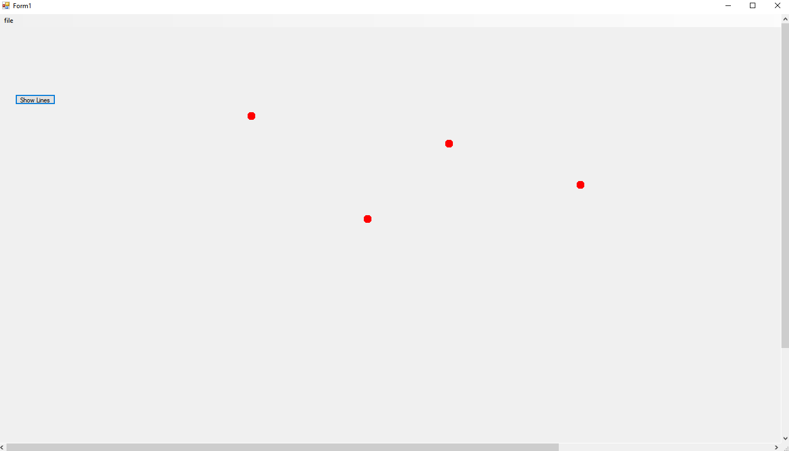
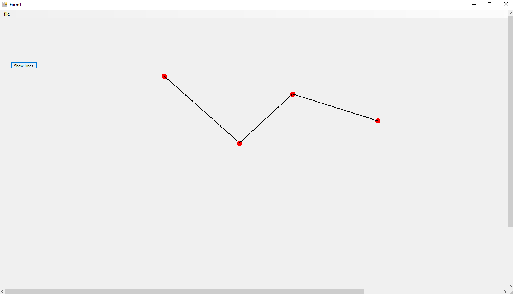

# Connect_the_dots
C# ASP.NET application which has an override to the OnPaint function to draw lines between the coordinates of painted dots on a scrollable canvas. The button click draws lines between the dots in order, or hides the lines to just show the unconnected dots.

